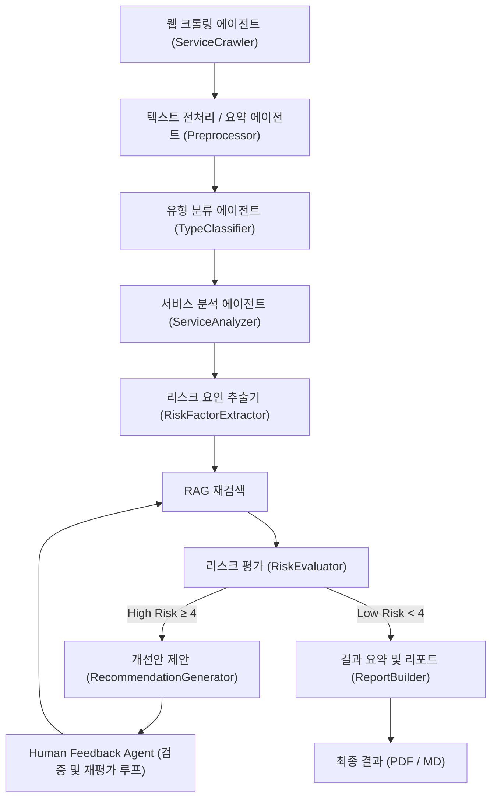

# 🧭 AI 윤리성 리스크 진단 (AI Ethics Audit Agent)

본 프로젝트는 **AI 윤리성 리스크 진단 에이전트(AI Ethics Audit Agent)** 를 설계하고 구현한 실습 프로젝트입니다.  
LangGraph 기반 멀티 에이전트 시스템을 통해 **AI 서비스 유형(생성형, 추천형, 예측형)** 을 자동 분류하고,  
국제 AI 윤리 가이드라인(EU AI Act, OECD, UNESCO)에 따라 **윤리 리스크 분석·피드백·개선 권고안 생성**을 자동화합니다.  

본 프로젝트는 **RAG (Retrieval-Augmented Generation)** 기반으로 문서 근거를 검색하고,  
**Human Feedback Loop**을 통해 재검색·재평가·개선안을 반복적으로 보완하는 **AI 윤리 진단 워크플로우**를 구현합니다.

---

## 📘 Overview

- **Objective**  
  AI 서비스를 대상으로 편향성, 공정성, 프라이버시, 투명성 등의 윤리 리스크를 진단하고  
  국제 기준(EU, OECD, UNESCO)에 따른 **정량 평가 + 개선안 자동화 리포트**를 생성합니다.

- **Methods**  
  - Multi-Agent Workflow (LangGraph 기반)
  - RAG (Retrieval-Augmented Generation)
  - Human-in-the-loop 재평가 루프
  - Tavily API 기반 웹 크롤링 자동화
  - Prompt Engineering & Contextual Reasoning

- **Tools & Frameworks**  
  LangGraph · LangChain · GPT-4o-mini · ChromaDB · ReportLab · Python 3.11

---

## ⚙️ Features

| 기능 | 설명 |
|------|------|
| 🌐 **Tavily 웹 크롤링 자동 분석** | 서비스명을 입력하면 관련 웹 정보를 자동 수집 및 요약 |
| 🤖 **서비스 구조 분석 및 유형 분류** | 수집된 설명을 기반으로 AI 서비스 유형(생성형·추천형·예측형) 자동 분류 |
| ⚖️ **윤리 리스크 진단** | 10대 항목별 리스크 점수(1~5) 및 코멘트 생성 |
| 📚 **RAG 기반 가이드라인 검색** | EU, OECD, UNESCO 윤리 문서를 근거로 평가 수행 |
| 🗣️ **Human Feedback 기반 재평가 루프** | 사용자의 검증 의견을 반영한 재검색 및 재평가 수행 |
| 💡 **개선안 생성 및 제안** | 가이드라인 조항 기반으로 구체적 개선 방향 제시 |
| 📊 **리포트 자동화** | Markdown / PDF 형태의 윤리 진단 보고서 자동 출력 |

---

## 🧩 Tech Stack

| Category | Details |
|-----------|----------|
| **Framework** | LangGraph, LangChain |
| **LLM** | GPT-4o-mini (OpenAI) |
| **Vector DB** | Chroma (FAISS backend) |
| **Embedding** | text-embedding-3-small |
| **Web Crawler** | Tavily API |
| **Visualization** | Mermaid, Graphviz |
| **Report Engine** | ReportLab, Pandas |
| **Environment** | Python 3.11, dotenv(OpenAI API Key, Tavily API Key) |

---

## 🧠 Agents

| 단계 | Agent | 주요 역할 | 입력 | 출력 |
|------|--------|------------|-------------|-------------|
| 0️⃣ | **ServiceCrawlerAgent** | Tavily API를 통해 서비스 관련 웹 정보를 수집 및 요약 | 서비스명 | `service_description` |
| 1️⃣ | **PreprocessorAgent** | 텍스트 전처리 및 핵심 문맥 요약 | `service_description` | `clean_summary` |
| 2️⃣ | **TypeClassifierAgent** | AI 서비스 유형 자동 분류 | `clean_summary` | `service_type` |
| 3️⃣ | **ServiceAnalyzerAgent** | 목적, 입력·출력, 구조 분석 | `service_info` | `service_profile` |
| 4️⃣ | **RiskFactorExtractor** | 잠재적 윤리 리스크 요인 추출 | `service_profile` | `risk_factors` |
| 5️⃣ | **RAGRetrieverAgent** | 국제 가이드라인 근거 검색 | `risk_factors` | `policy_context` |
| 6️⃣ | **RiskEvaluator** | 윤리 리스크 점수 및 코멘트 생성 | `policy_context` | `risk_assessment` |
| 7️⃣ | **RecommendationGenerator** | 리스크 수준별 개선안 제안 | `risk_assessment` | `recommendations` |
| 8️⃣ | **HumanFeedbackAgent** | 사용자의 검증 피드백 수집 (콘솔 입력) | `recommendations` | `human_feedback` |
| 9️⃣ | **RAGRetrieverAgent (재검색)** | 피드백 반영 재검색 | `human_feedback` | `policy_context (update)` |
| 🔟 | **ReportBuilder** | PDF/Markdown 보고서 생성 | `recommendations` | `report_final` |

---

## 🧮 State Definition

| State Key | Type | 생성 Agent | 사용 Agent | 설명 |
|------------|------|-------------|-------------|------|
| `service_description` | str | ServiceCrawlerAgent | PreprocessorAgent | 웹에서 수집한 서비스 설명 텍스트 |
| `clean_summary` | str | PreprocessorAgent | TypeClassifierAgent | 전처리된 서비스 요약 |
| `service_info` | dict | ServiceAnalyzerAgent | RiskFactorExtractor | 분석된 서비스 구조 및 데이터 특성 |
| `risk_factors` | list | RiskFactorExtractor | RAGRetrieverAgent | 추출된 윤리 리스크 요인 |
| `policy_context` | str | RAGRetrieverAgent | RiskEvaluator | RAG 기반으로 검색된 정책 근거 문단 |
| `risk_assessment` | dict | RiskEvaluator | RecommendationGenerator | 항목별 점수 및 코멘트 |
| `recommendations` | dict | RecommendationGenerator | HumanFeedbackAgent / ReportBuilder | 개선 권고안 |
| `human_feedback` | str | HumanFeedbackAgent | RAGRetrieverAgent / RiskEvaluator | 사용자 피드백 입력 |
| `report_final` | file | ReportBuilder | Output | 최종 결과 리포트 (Markdown/PDF) |

---

## 🔁 Feedback-Enhanced Workflow

| 단계 | 역할 | 처리 방식 |
| --- | --- | --- |
| 0️⃣ Service Crawling | Tavily API를 통해 서비스명 기반 웹정보 수집 및 요약 | `ServiceCrawlerAgent` |
| 1️⃣ Chunking & Embedding | 윤리 문서를 의미 단위로 벡터화 | `embed_guidelines.py` |
| 2️⃣ Query Generation | 윤리 항목별 질의 생성 | `RiskFactorExtractor` |
| 3️⃣ Retrieval | RAG 기반 근거 검색 (Chroma) | `RAGRetrieverAgent` |
| 4️⃣ Evaluation | 윤리 리스크 점수 및 코멘트 생성 | `RiskEvaluator` |
| 5️⃣ Recommendation | 리스크 수준별 개선안 제시 | `RecommendationGenerator` |
| 6️⃣ Human Feedback | 사용자의 검증 피드백 수집 | `HumanFeedbackAgent` |
| 7️⃣ Re-Retrieval / Re-Evaluation | 피드백 반영 재검색 및 재평가 수행 | `RAGRetrieverAgent + RiskEvaluator` |
| 8️⃣ Report Generation | PDF/MD 보고서 자동 생성 | `ReportBuilder` |

---

## 📊 Architecture (Mermaid Diagram)



---

## 📂 Directory Structure
```
ai_ethics_audit_agent/
├── agents/
│   ├── service_crawler.py          # Tavily 웹 크롤링 + 요약
│   ├── service_analyzer.py         # 서비스 구조 분석
│   ├── type_classifier.py          # AI 유형 자동 분류
│   ├── risk_factor_extractor.py    # 윤리 리스크 요인 추출
│   ├── rag_retriever.py            # Chroma 기반 RAG 검색
│   ├── risk_evaluator.py           # 윤리 리스크 점수화
│   ├── recommendation_generator.py # 개선안 제안
│   ├── human_feedback.py           # 사용자 피드백 수집
│   └── report_builder.py           # PDF/Markdown 보고서 생성
│
├── tools/
│   └── embed_guidelines.py         # EU/OECD/UNESCO PDF 임베딩
│
├── data/
│   ├── EU_AI_Act.pdf
│   ├── OECD_AI_Principles.pdf
│   ├── UNESCO_AI_Ethics.pdf
│   └── vectorstore/                # ChromaDB 저장소
│
├── outputs/
│   ├── reports/
│   └── logs/
│
├── main.py                         # 메인 워크플로우 (크롤링 → 평가 → 리포트)
└── README.md
```

---