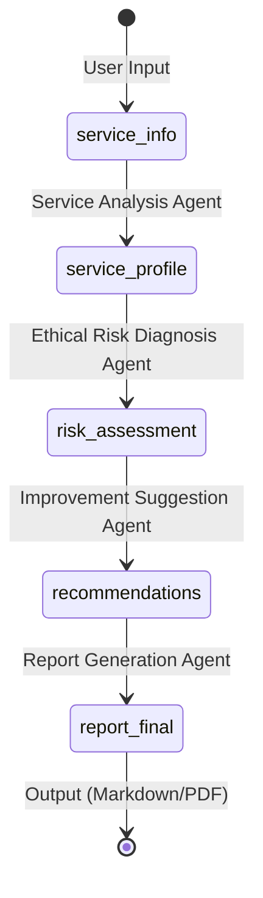
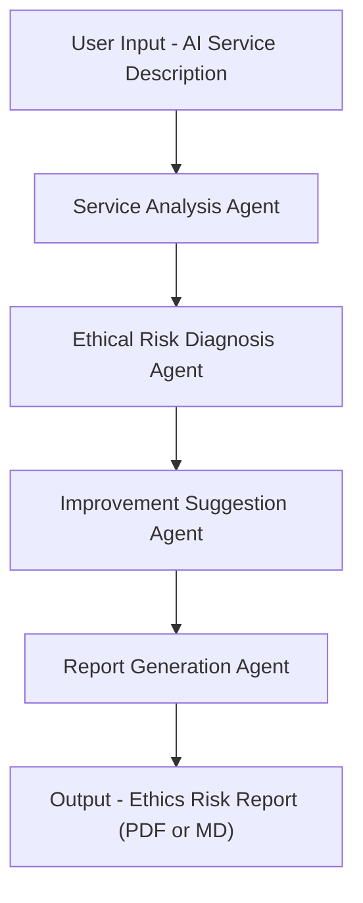

# 🧭 AI 윤리성 리스크 진단 (AI Ethics Audit Agent)
## ✅ Summary

본 프로젝트는 AI 윤리성 리스크 진단 에이전트(AI Ethics Audit Agent)를 설계하고 구현한 실습 프로젝트입니다.  
LangGraph 기반 멀티 에이전트 시스템을 통해 특정 AI 서비스 유형(생성형 AI, 추천형 AI, 예측형 AI)을 진단하고,  
국제 AI 윤리 가이드라인(EU AI Act, OECD, UNESCO)에 따라 윤리 리스크 분석 및 개선 권고안을 자동 생성합니다.

---

## 📘 Overview

- **Objective:**  
  특정 AI 서비스 유형을 대상으로 윤리 리스크(편향성, 프라이버시 침해, 투명성 부족 등)를 분석하고  
  EU AI Act, OECD, UNESCO 기준을 적용하여 개선 권고안 및 리포트를 자동 생성하는 시스템 개발

- **Methods:**  
  Prompt Engineering, Multi-Agent Workflow (LangGraph), Rule-based Ethical Scoring  

- **Tools:**  
  LangGraph, LangChain, OpenAI GPT-4o-mini, Pandas, ReportLab

---

## ⚙️ Features

- 🤖 **서비스 분석 자동화** — AI 서비스의 목적, 입력 데이터, 주요 기능을 분석  
- ⚖️ **윤리 리스크 진단** — 편향성, 프라이버시, 투명성 등 10대 윤리 항목별 평가  
- 💡 **개선 권고안 제안** — 국제 AI 윤리 가이드라인(EU, OECD, UNESCO) 기반 개선 방향 제시  
- 📊 **자동 리포트 생성** — 평가 결과를 Markdown 및 PDF 형태로 리포트화  

---

## 🧩 Tech Stack 

| Category   | Details |
|-------------|----------|
| **Framework** | LangGraph, LangChain, Python 3.11 |
| **LLM** | GPT-4o-mini via OpenAI API |
| **Retrieval** | FAISS, Chroma |
| **Embedding** | OpenAIEmbedding (text-embedding-3-small) |
| **Visualization** | Mermaid, Graphviz |
| **Report** | ReportLab, pypandoc |

---

## 🧠 Agents
 
- **Service Analysis Agent** : AI 서비스 개요 및 기능 분석  
- **Ethical Risk Diagnosis Agent** : 윤리 기준(EU AI Act, OECD, UNESCO)에 따른 리스크 평가  
- **Improvement Suggestion Agent** : 항목별 개선 방향 제시  
- **Report Generation Agent** : 평가 결과 및 개선안 기반 리포트 작성 (Markdown/PDF)

---

### 🧮 State Definition
LangGraph의 State는 각 에이전트 간 데이터를 전달하는 핵심 구조입니다.  
아래는 본 프로젝트의 주요 State 스키마와 데이터 흐름 정의입니다.

---

### 📦 State Schema

| State Key | Data Type | 생성 Agent | 사용 Agent | 설명 |
|------------|------------|-------------|-------------|-------------|
| `service_info` | dict | User Input | Service Analysis | 사용자가 입력한 AI 서비스 기본 정보 (유형, 목적, 사용 데이터 등) |
| `service_profile` | dict | Service Analysis | Ethical Risk Diagnosis | 분석된 서비스 구조 요약 및 데이터 처리 특성 |
| `risk_assessment` | dict | Ethical Risk Diagnosis | Improvement Suggestion | 윤리 항목별 점수(1~5), 평가 코멘트, 리스크 수준 포함 |
| `recommendations` | dict | Improvement Suggestion | Report Generation | 항목별 개선 권고안 및 관련 가이드라인(EU/OECD/UNESCO) |
| `report_summary` | str | Report Generation | Report Generation | 주요 리스크 및 개선 요약문 |
| `report_final` | file (md/pdf) | Report Generation | Output | 최종 리포트 결과물 (Markdown, PDF) |

---
### 📦 State Transition Diagram


---

## 🧭 Architecture


## Directory Structure
```markdown
<pre><code>
ai-ethics-audit-agent/
├── agents/
│   ├── service_analysis.py
│   ├── ethical_risk_diagnosis.py
│   ├── improvement_suggestion.py
│   └── report_generation.py
├── prompts/
│   ├── service_analysis_prompt.txt
│   ├── ethical_risk_prompt.txt
│   ├── improvement_prompt.txt
│   └── report_prompt.txt
├── outputs/
└── README.md
</code></pre>
```

