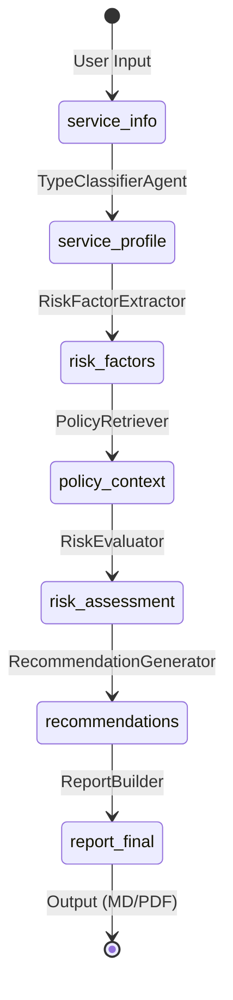
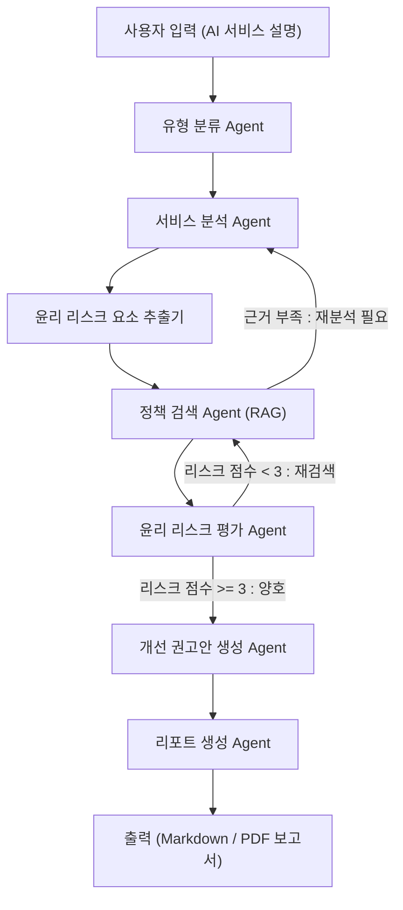

# 🧭 AI 윤리성 리스크 진단 (AI Ethics Audit Agent)
## ✅ Summary

본 프로젝트는 AI 윤리성 리스크 진단 에이전트(AI Ethics Audit Agent)를 설계하고 구현한 실습 프로젝트입니다.  
LangGraph 기반 멀티 에이전트 시스템을 통해 특정 AI 서비스 유형(생성형 AI, 추천형 AI, 예측형 AI)을 진단하고,  
국제 AI 윤리 가이드라인(EU AI Act, OECD, UNESCO)에 따라 윤리 리스크 분석 및 개선 권고안을 자동 생성합니다.

---

## 📘 Overview

- **Objective**  
  AI 서비스(생성형, 예측형, 추천형)를 대상으로  
  윤리 리스크(편향성, 프라이버시 침해, 투명성 부족 등)를 진단하고  
  국제 기준 기반의 **리스크 스코어링 + 개선안 + 리포트 자동화**를 수행합니다.

- **Methods**  
  - Multi-Agent Workflow (LangGraph)  
  - RAG (Retrieval-Augmented Generation)  
  - Prompt Engineering & Context-Aware Reasoning  

- **Tools & Frameworks**  
  LangGraph · LangChain · GPT-4o-mini · ChromaDB · ReportLab · Python 3.11

---

## ⚙️ Features

| 기능 | 설명 |
|------|------|
| 🤖 **자동 서비스 분석** | 입력된 설명으로부터 AI 유형 및 구조 자동 판별 |
| ⚖️ **윤리 리스크 진단** | 10대 항목별 리스크 점수 및 코멘트 생성 |
| 📚 **RAG 기반 정책 검증** | EU, OECD, UNESCO 문서 근거를 기반으로 판단 |
| 💡 **개선 권고안 생성** | 가이드라인 조항 기반 구체적 권고 제시 |
| 📊 **리포트 자동화** | Markdown / PDF 형태의 리포트 자동 출력 |

---

## 🧩 Tech Stack 

| Category | Details |
|-----------|----------|
| **Framework** | LangGraph, LangChain |
| **LLM** | GPT-4o-mini (OpenAI) |
| **Vector DB** | Chroma (FAISS backend) |
| **Embedding** | text-embedding-3-small |
| **Visualization** | Mermaid, Graphviz |
| **Report Engine** | ReportLab, Pandas |
| **Environment** | Python 3.11, .env(OpenAI API Key) |

---

## 🧠 Agents
 
| 단계 | Agent | 핵심 역할 | 주요 입력 | 주요 출력 |
|------|--------|------------|-------------|-------------|
| ① | **TypeClassifierAgent** | AI 서비스 유형 자동 분류 | 서비스 설명 | `service_info["type"]` |
| ② | **ServiceAnalyzerAgent** | 목적, 입력·출력, 구조 분석 | `service_info` | `service_profile` |
| ③ | **RiskFactorExtractor** | 잠재적 윤리 리스크 요인 추출 | `service_profile` | `risk_factors` |
| ④ | **PolicyRetriever (RAG)** | 국제 가이드라인 근거 검색 | `risk_factors` | `policy_context` |
| ⑤ | **RiskEvaluator** | 항목별 점수화 및 평가 코멘트 | `policy_context` | `risk_assessment` |
| ⑥ | **RecommendationGenerator** | 개선안 생성 + 관련 조항 연결 | `risk_assessment` | `recommendations` |
| ⑦ | **ReportBuilder** | PDF/Markdown 리포트 생성 | `recommendations` | `report_final` |

---

### 🧮 State Definition
LangGraph의 State는 각 에이전트 간 데이터를 전달하는 핵심 구조입니다.  
아래는 본 프로젝트의 주요 State 스키마와 데이터 흐름 정의입니다.

---

### 📦 State Schema

| State Key | Data Type | 생성 Agent | 사용 Agent | 설명 |
|------------|------------|-------------|-------------|-------------|
| `service_info` | dict | User Input | Service Analysis | 사용자가 입력한 AI 서비스 기본 정보 (유형, 목적, 사용 데이터 등) |
| `service_profile` | dict | Service Analysis | Ethical Risk Diagnosis | 분석된 서비스 구조 요약 및 데이터 처리 특성 |
| `risk_assessment` | dict | Ethical Risk Diagnosis | Improvement Suggestion | 윤리 항목별 점수(1~5), 평가 코멘트, 리스크 수준 포함 |
| `recommendations` | dict | Improvement Suggestion | Report Generation | 항목별 개선 권고안 및 관련 가이드라인(EU/OECD/UNESCO) |
| `report_summary` | str | Report Generation | Report Generation | 주요 리스크 및 개선 요약문 |
| `report_final` | file (md/pdf) | Report Generation | Output | 최종 리포트 결과물 (Markdown, PDF) |

---
### 📦 State Transition Diagram


---

## 🧭 Architecture

---

## Directory Structure
```markdown
<pre><code>
ai-ethics-audit-agent/
├── agents/
│   ├── type_classifier.py
│   ├── service_analysis.py
│   ├── risk_factor_extractor.py
│   ├── policy_retriever.py
│   ├── risk_evaluator.py
│   ├── recommendation_generator.py
│   ├── report_builder.py
│   └── rag_utils.py
├── tools.py
├── data/
│   ├── EU_AI_Act_Summary.txt
│   ├── OECD_AI_Principles.txt
│   └── UNESCO_AI_Ethics.txt
├── outputs/
│   ├── ethics_audit_report.md
│   └── ethics_audit_report.pdf
├── prompts/
├── .env
├── requirements.txt
└── app.py

</code></pre>
```

---
## 🔧 Tool Function Definition

LangGraph 각 에이전트는 내부적으로 다음의 **도구 함수(tool function)** 를 호출합니다.

| Tool 이름 | 역할 | 사용 Agent | 설명 |
|------------|-------|-------------|------|
| `get_llm()` | GPT-4o-mini 모델 호출 | 모든 Agent | OpenAI API로 질의 수행 |
| `ensure_retriever()` | Chroma 벡터DB 구축/로드 | PolicyRetriever | `/data` 문서 임베딩 후 RAG 검색 |
| `search_guideline(term)` | 특정 항목 관련 조항 검색 | RiskEvaluator / RecommendationGenerator | “Transparency 관련 조항” 등 검색 |
| `score_ethics(criteria, context)` | 윤리 항목 점수 계산 | RiskEvaluator | 근거(Context) 기반 점수 산정 |
| `generate_recommendations(assessment, context)` | 개선안 생성 | RecommendationGenerator | 리스크 기반 권고 생성 |
| `generate_report_md(summary)` | Markdown 리포트 생성 | ReportBuilder | 평가 결과 및 권고안 정리 |
| `generate_report_pdf(summary)` | PDF 리포트 생성 | ReportBuilder | ReportLab으로 시각화 리포트 생성 |